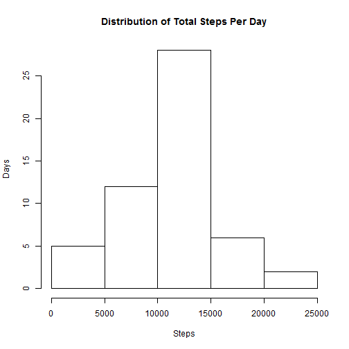
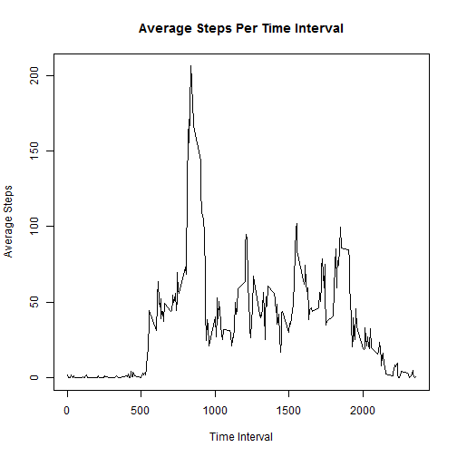
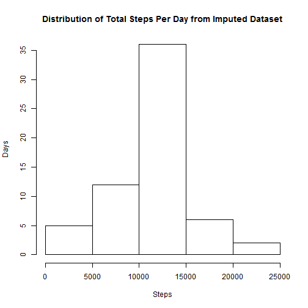
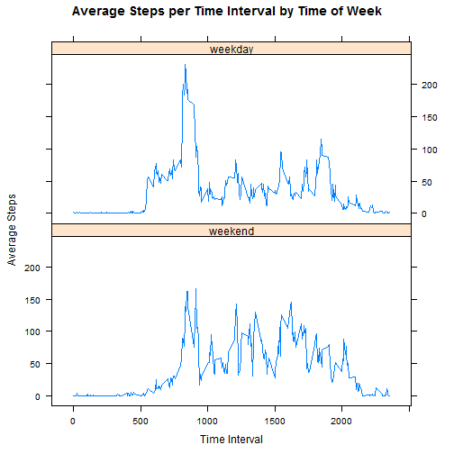

### Overview

The rise of wearable activity monitoring devices has led to increase in available data, but available data doens't always lead to new insights. The purpose of this assignment is to analyze data from a personal activity monitoring device to extract new insights about the user.

The dataset used for this analysis was collected between October and November of 2012, and each row contains a date, a five minute time interval, and the number of steps recorded during each interval.

### Dataset

The activity monitoring [dataset](https://d396qusza40orc.cloudfront.net/repdata%2Fdata%2Factivity.zip) used in this exercise contains the three following parameters:

```
Parameter Name:   steps
Description:      Contains the number of steps during a 5 minute interval
Type:             Integer
Allowed Values:   Integers greater than or equal to zero, or NA
Units:            Number of steps

```

```
Parameter Name:   date
Description:      Date at which the steps were recorded
Type:             String
Allowed Values:   Dates in the format (YYYY-MM-DD)
Units:            N/A
```

```
Parameter Name:   interval
Description:      Five minute interval during a given day
Type:             Integer
Allowed Values:   0 Through 2355 (Military Time Format without preceding 0's)
Units:            N/A
```


### Loading the data


The first step is to load the "activity.csv" file into the dataset variable. This dataset does include some step values assigned to NA. For the first part of the analysis, the NA values will simply be ignored.


```r
# Load Activity Data
dataset = read.csv("activity.csv")
head(dataset)
```

```
##   steps       date interval
## 1    NA 2012-10-01        0
## 2    NA 2012-10-01        5
## 3    NA 2012-10-01       10
## 4    NA 2012-10-01       15
## 5    NA 2012-10-01       20
## 6    NA 2012-10-01       25
```

### Mean total number of steps taken per day


To determine the mean and median number of steps per day, the "sqldf" library will be used for grouping data.


```r
#Total Number of Steps Taken Per Day
library(sqldf)
steps_day = sqldf("
                    select 
                      date,
                      sum(steps) as steps
                    from 
                      dataset 
                    where 
                      steps <> 'NA' 
                    group by 
                      date;
                  ")
head(steps_day)
```

```
##         date steps
## 1 2012-10-02   126
## 2 2012-10-03 11352
## 3 2012-10-04 12116
## 4 2012-10-05 13294
## 5 2012-10-06 15420
## 6 2012-10-07 11015
```
The "steps_day" data frame now contains total number of steps for each recorded day. A distribution of the steps per day can be generated to give a better understanding of how these values varies.


```r
#Make a Histogram for Steps / Day
hist(steps_day$steps, main = "Distribution of Total Steps Per Day", xlab = "Steps", ylab = "Days")
```

 


The histogram suggests that the median number of steps per day is somewhere between 10,000 and 15,000 steps, but the more precise mean and median values for steps per day can be found below.


```r
#Get Mean and Median of Steps / Day
steps_mean = mean(steps_day$steps)
steps_median = median(steps_day$steps)
```


```r
steps_mean
```

```
## [1] 10766.19
```

```r
steps_median
```

```
## [1] 10765
```

### Average Daily Activity Pattern

Besides looking at total number of steps in a given day, it may be useful to look at a typical daily pattern. This can be accomplished by averaging steps during each interval from multiple days.


```r
#Get behavior each day using average by interval
steps_behavior_daily = sqldf("
                                select 
                                  interval, 
                                  avg(steps) as avg_steps 
                                from 
                                  dataset 
                                where 
                                  steps <> 'NA' 
                                group by 
                                  interval;
                             ")
head(steps_behavior_daily)
```

```
##   interval avg_steps
## 1        0 1.7169811
## 2        5 0.3396226
## 3       10 0.1320755
## 4       15 0.1509434
## 5       20 0.0754717
## 6       25 2.0943396
```


The "steps_behavior_daily" dataframe now contains the average number of steps for each 5 minute time interval during the day. Generating a line plot shows the general variation in behavior over the course of the user's day.


```r
#Plot the daily average steps per interval
plot(steps_behavior_daily$interval, steps_behavior_daily$avg_steps, type = "l",
     xlab = "Time Interval", ylab = "Average Steps", 
     main = "Average Steps Per Time Interval")
```

 


There is a period of consistently low activity up until time interval 500, and then a large spike occurs at some point between time interval 500 and 1000. The values for maximum step ("max_steps") and maximum step time interval ("max_steps_at") are printed below.


```r
#Get the max number of steps, where the max step occurs
max_steps = max(steps_behavior_daily$avg_steps)
max_steps_at = steps_behavior_daily$interval[steps_behavior_daily$avg_steps == max_steps]
```


```r
max_steps
```

```
## [1] 206.1698
```

```r
max_steps_at
```

```
## [1] 835
```

The location of the high spike in steps was at time interval 835.


### Imputing Missing Values

Before the step values of NA had simply been ignored, but now their values will be replaced in an effort to avoid bias in summaries. The first step is to determine how many NA values are in the dataset.


```r
#Get the number of NA's in the dataset
count_NA = nrow(subset(dataset, is.na(steps)))
count_NA
```

```
## [1] 2304
```

2304 rows with steps equal to NA were found.

The NA values will be replaced in a new imputed dataset. Any step value of NA will be replaced with the average 5 minute step value interval from the daily activity pattern data set. First, the main "dataset" data frame is merged with the daily activity pattern data set using the interval parameter.


```r
# Account for the NA's. They will be filled in using the average steps per interval from
# "steps_behavior_daily". The dataset will be merged on the "interval" parameter

#Merge on the "interval" parameter
dataset_imputed = merge(dataset, steps_behavior_daily, by = "interval")
head(dataset_imputed)
```

```
##   interval steps       date avg_steps
## 1        0    NA 2012-10-01  1.716981
## 2        0     0 2012-11-23  1.716981
## 3        0     0 2012-10-28  1.716981
## 4        0     0 2012-11-06  1.716981
## 5        0     0 2012-11-24  1.716981
## 6        0     0 2012-11-15  1.716981
```
All NA values are then replaced with their corresponding average steps from the daily behavior dataset.


```r
#Replace data with the avg_steps where NA's are present
dataset_imputed$steps[is.na(dataset_imputed$steps)]<-
    dataset_imputed$avg_steps[is.na(dataset_imputed$steps)]
head(dataset_imputed)
```

```
##   interval    steps       date avg_steps
## 1        0 1.716981 2012-10-01  1.716981
## 2        0 0.000000 2012-11-23  1.716981
## 3        0 0.000000 2012-10-28  1.716981
## 4        0 0.000000 2012-11-06  1.716981
## 5        0 0.000000 2012-11-24  1.716981
## 6        0 0.000000 2012-11-15  1.716981
```

To take a look at the effects of imputing the dataset, first a distribution will be generated for total steps per day.


```r
#Get steps per day from the imputed dataset
steps_day_imp = sqldf("
                    select 
                      date,
                      sum(steps) as steps
                    from 
                      dataset_imputed 
                    where 
                      steps <> 'NA' 
                    group by 
                      date;
                  ")

#Make a Histogram for Steps / Day for the imputed dataset
hist(steps_day_imp$steps, main = "Distribution of Total Steps Per Day from Imputed Dataset", 
     xlab = "Steps", ylab = "Days")
```

 


It's difficult to quantify an impact by just looking at the histogram, so the mean and median from the imputed dataset are calculated.


```r
#Get Mean and Median of Steps / Day for the imputed dataset
steps_mean_imp = mean(steps_day_imp$steps)
steps_median_imp = median(steps_day_imp$steps)
```


```r
steps_mean_imp
```

```
## [1] 10766.19
```

```r
steps_median_imp
```

```
## [1] 10766.19
```

The difference between the original mean and median values are then compared to their imputed counterparts.


```r
#Get delta's from imputed data and original set
delta_mean = steps_mean_imp - steps_mean
delta_median = steps_median_imp - steps_median
```


```r
delta_mean
```

```
## [1] 0
```

```r
delta_median
```

```
## [1] 1.188679
```
The mean did not change, but the median value increased by 1.19 steps per day for the imputed dataset.

### Difference in activity patterns between weekdays and weekends

Another way to break out the data is to look at patterns based on day of the week. In particular, the difference between weekdays and weekend days will be compared.


The first step is to create a factor variable for weekend or weekday by first finding whether or not each date is Saturday or Sunday, or another day of the week.


```r
#Use weekdays to determine whether it's a weekend or weekday
weekend_array = (weekdays(as.Date(dataset_imputed$date))==("Sunday")) | 
  (weekdays(as.Date(dataset_imputed$date))==("Saturday"))

#Set the factor names
weekend_array = factor(weekend_array, levels = c("TRUE", "FALSE"), 
                       labels = c("weekend", "weekday"))
head(weekend_array)
```

```
## [1] weekday weekday weekend weekday weekend weekday
## Levels: weekend weekday
```
The weekend factor array is then bound to the imputed dataset, and the weekend factor will be referred to as "day_type".


```r
dataset_imputed = cbind(dataset_imputed, weekend_array)
colnames(dataset_imputed)[5] = "day_type"
head(dataset_imputed)
```

```
##   interval    steps       date avg_steps day_type
## 1        0 1.716981 2012-10-01  1.716981  weekday
## 2        0 0.000000 2012-11-23  1.716981  weekday
## 3        0 0.000000 2012-10-28  1.716981  weekend
## 4        0 0.000000 2012-11-06  1.716981  weekday
## 5        0 0.000000 2012-11-24  1.716981  weekend
## 6        0 0.000000 2012-11-15  1.716981  weekday
```

The average steps per time interval are then calculated again, but this time using the imputed dataset and grouped by day type.


```r
#Average steps per interval grouped by day type (weekend / weekday)
steps_day_imp = sqldf("
                    select 
                      day_type,
                      interval,
                      avg(steps) as avg_steps
                    from 
                      dataset_imputed 
                    where 
                      steps <> 'NA' 
                    group by 
                      day_type,
                      interval;
                  ")
head(steps_day_imp)
```

```
##   day_type interval  avg_steps
## 1  weekday        0 2.25115304
## 2  weekday        5 0.44528302
## 3  weekday       10 0.17316562
## 4  weekday       15 0.19790356
## 5  weekday       20 0.09895178
## 6  weekday       25 1.59035639
```

The average steps per interval are then plotted, but grouped by day type.


```r
#Make a panel line plot for average steps per interval, grouped by day type (weekend or weekday)
library(lattice)
xyplot(avg_steps ~ interval|day_type, data = steps_day_imp, type = "l", layout = c(1,2),
        xlab = "Time Interval", ylab = "Average Steps", 
        main = "Average Steps per Time Interval by Time of Week")
```

 

The trend suggests different behavior for weekend days as opposed to weekdays. For instance, the first point at which steps start increasing occurs at a higher time interval on weekends as opposed to weekdays. For the weekends, there also tended to be a more consistent level of high spikes in steps per interval. In contrast, the weekdays show a very large spike towards the beginning of the day and then has much lower spikes thereafter.
